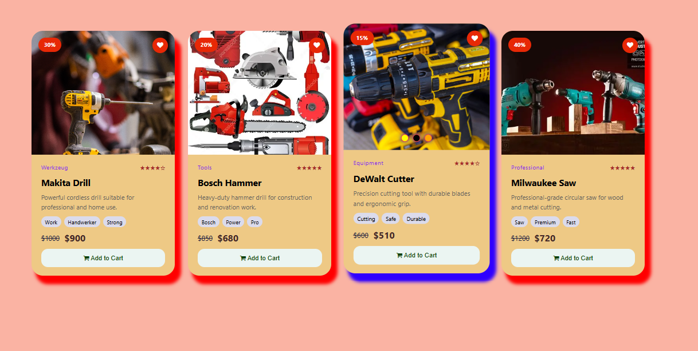

  
  <h1>Karts | Product Cards</h1>
  
 Built with HTML & CSS

  
  
  
  

---

## 📌 About
This is my first project built with VS Code.  
The goal is to create clean, responsive product cards for a tools shop with